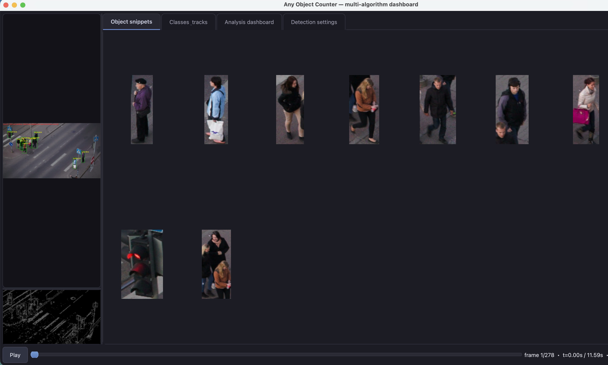
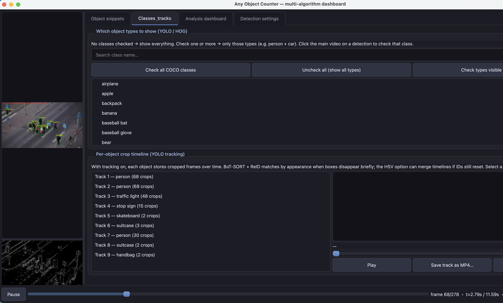
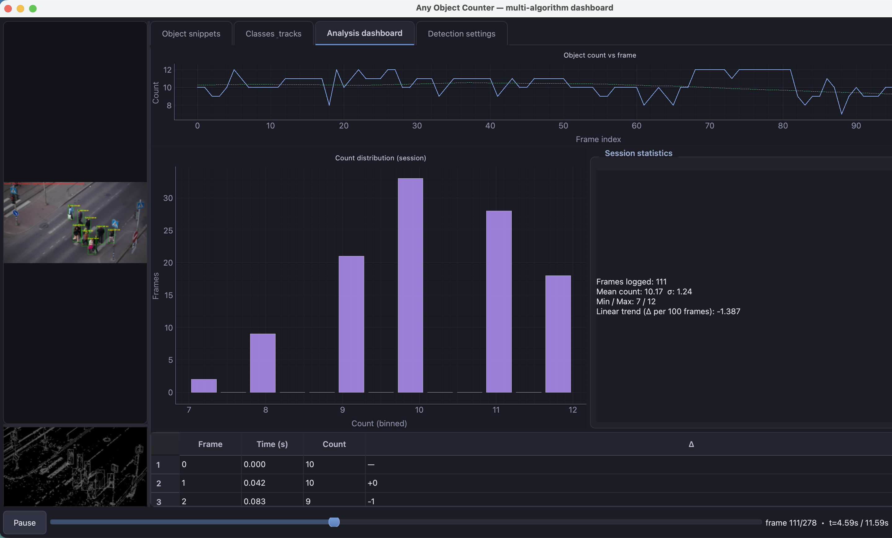
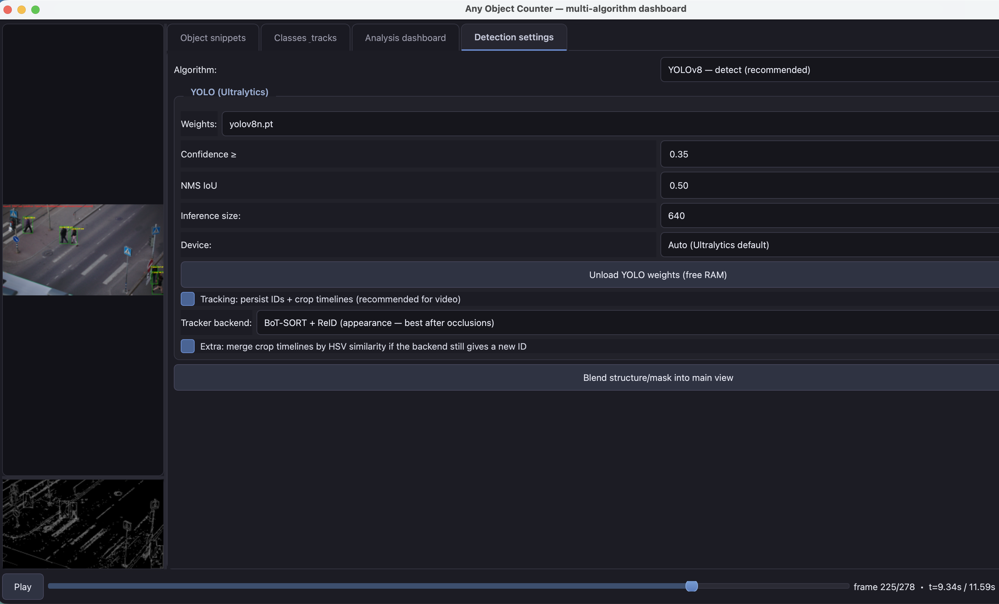

# Any Object Counter

[](https://github.com/MohammedAl-harthi/AnyObjectCounter)

**YOLO / COCO–powered object tracker and detector** — PyQt6 desktop app for **video / webcam counting** with **Ultralytics YOLO**, classical OpenCV pipelines, an **analysis dashboard**, **class filters**, **multi-object tracking**, and **per-object crop timelines** (scrub + MP4 export). **Elegant dark** Fusion UI.

**Home:** [github.com/MohammedAl-harthi/AnyObjectCounter](https://github.com/MohammedAl-harthi/AnyObjectCounter)



---

## Features

| Area | What you get |
|------|----------------|
| **Detection** | YOLOv8 detect & segment, **BoT-SORT + ReID** or **ByteTrack**, HOG pedestrians, legacy edge / MOG2 methods |
| **Filtering** | Multi-select **COCO classes**, or **click the video** on a box to pin that class |
| **Tracking** | Persistent IDs, optional **HSV appearance merge** if IDs reset after short gaps |
| **Analysis** | Count vs frame, rolling mean, histogram, session stats, data table |
| **Exports** | Save a **single track** as **MP4** (crop sequence) |



---

## Screenshots

> Add PNG or JPG files under [`Screenshots/`](Screenshots/). The paths below match the filenames the README expects.

| | |
|:--|:--|
| **Classes & tracks** — checklist, click-to-class, track list, scrubber, export |  |
| **Analysis dashboard** — plots and table |  |
| **Detection settings** — YOLO / tracker / legacy controls |  |

---

## Requirements

- Python **3.10+** (tested with 3.13)
- macOS / Linux / Windows (GUI + optional CUDA / MPS for YOLO)

Dependencies are listed in [`requirements.txt`](requirements.txt) (`PyQt6`, `opencv-python-headless`, `numpy`, `pyqtgraph`, `ultralytics`). First YOLO run may download `.pt` weights.

---

## Install

```bash
git clone https://github.com/MohammedAl-harthi/AnyObjectCounter.git
cd AnyObjectCounter
python3 -m venv .venv
source .venv/bin/activate   # Windows: .venv\Scripts\activate
pip install -r requirements.txt
```

Optional: place weights next to the app (e.g. `yolov8n.pt`) or let Ultralytics download them on first inference.

---

## Run

```bash
python main.py
```

**File → Open video** or **Use webcam**. In **Detection settings**, pick algorithm, tracker (**BoT-SORT + ReID** recommended for occlusions), and tune confidence / class filters on the **Classes & tracks** tab.

---

## Project layout

```
AnyObjectCounter/
├── main.py                 # Entry point
├── requirements.txt
├── README.md
├── Screenshots/            # Screenshots for this README (see table above)
└── app/
    ├── main_window.py      # UI, tabs, tracking buffers
    ├── detectors.py        # Algorithms + class filter
    ├── yolo_runner.py      # YOLO predict / track
    ├── trackers/
    │   └── botsort_reid.yaml
    ├── appearance_bridge.py
    ├── analysis.py
    ├── coco_names.py
    └── dark_theme.py
```

---

## License

Specify your license here (e.g. MIT). Dependencies include **Ultralytics YOLO** ([AGPL-3.0](https://github.com/ultralytics/ultralytics/blob/main/LICENSE)); comply when distributing binaries or services.

---

## Contributing

Pull requests welcome. When updating the README, keep images in **`Screenshots/`** and use relative paths like `Screenshots/your-image.png` so they render on GitHub.
